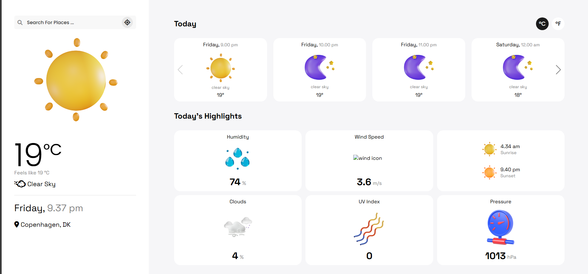

# Backend smooth weather app
Smooth weather is a weather app with a great visual design, it supports searching locations by city name.

## Preview

## 🌐 **[Live Preview](http://weather-app.my-style.in/)**



## Installation

```
$ npm install
```

## App Configuration

Get Your OpenWeatherMap API KEY here: https://home.openweathermap.org/api_keys

⚠️ **Important Instructions** ⚠️:

- Create `.env` file in root of the project.
- Copy the variable from [sample.env](https://github.com/jkalbasri/backend--weather-app/blob/main/sample.env) and paste it into `.env`
- Change the desired value. _eg_ API Key

## AA 


